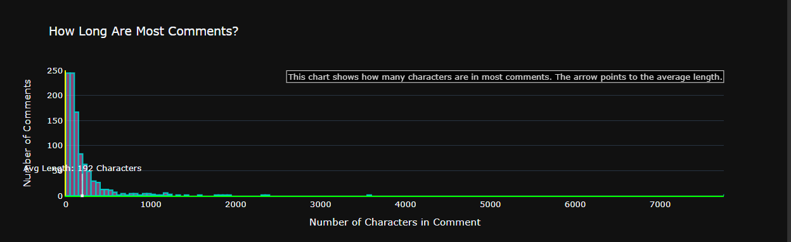
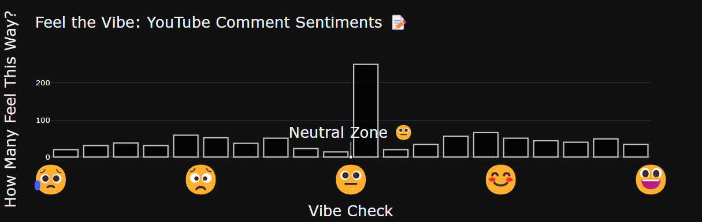
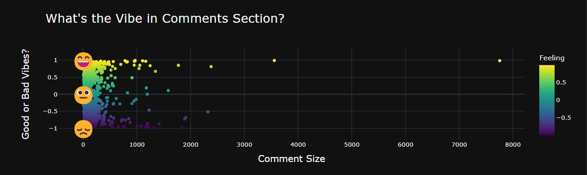

# 📊 ML-YTVibes-CommentAnalyzer

ML-YTVibes-CommentAnalyzer is a Python application designed to **analyze the sentiments** of comments on a YouTube video and provide **insights into the emotions** expressed by viewers.

---

## 🌟 Introduction

Understanding the sentiments of YouTube viewers can be crucial for content creators and marketers. This application provides a simple yet powerful way to gauge the emotional response of the audience to a video, helping creators and analysts make data-driven decisions.

---

## 🎯 Features

- **🔍 Sentiment Analysis**: Uses NLP to analyze the sentiments of comments.
- **📊 Sentiment Visualization**: Interactive histograms and scatter plots to visualize sentiments.
- **📝 Comment Length Analysis**: Relates comment length to sentiment.
- **☁️ Word Cloud Generation**: Identifies most frequently used words in comments.

---

## 📈 Visualizations

### 📌 Word Cloud of Frequent and Interesting Words

_Description: Shows the most frequent and interesting words appearing in YouTube comments._

### 📌 Comment Length and Frequency Bar Chart

_Description: Displays the frequency of different comment lengths._

### 📌 Comment Length Distribution Bar Chart

_Description: Distribution of comment lengths on a YouTube video._

### 📌 Vibe Check Bar Chart

_Description: Sentiment analysis categorized as positive, negative, or neutral._

### 📌 Vibe Scatter Plot

_Description: Scatter plot showing the relationship between comment length and sentiment._

---

## 🚀 Getting Started

1. **Clone or download** this repository to your local machine.
2. Ensure you have **Python** installed on your system (Python 3.x recommended).
3. Install the required Python libraries by running the following command:

   ```bash
   pip install -r requirements.txt
